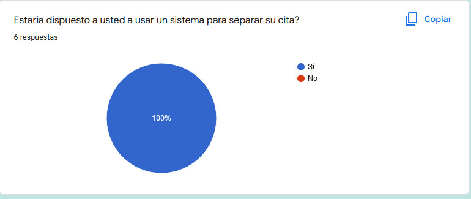

**“PROYECTO DE ANALISIS DE SISTEMAS”**

---

***sistemas para solicitud de citas de referencias en SIS***

---
**Hospital Nacional Arzobispo Loayza** 
**PROFESOR: RICHARD LEONARDO BERROCAL NAVARRO**

**ORCID: 0000-0001-8718-3150**
` `**EQUIPO NRO. 1**

**INTEGRANTES**

Carlos Melecio Ramirez Calderon(orcid.org/0000-0002-5893-7408) (100 %)

Sancho Diaz,Erika Yanela(0000-0002-4467-1346)   (100 %)

Brandon Baltazar La Torre(0000-0002-8806-8696)  (90 %)

Condori Condori, William Antony (0000-0001-5538-0627) (90 %)

Soto Trejo Cristel Jazmin (0000-0001-7485-1113)  (100 %)

Horna Zevallos Leonardo Douglas(0000-0001-8929-4858)     (90 %)

LIMA- 2022

RESUMEN EJECUTIVO.

INTRODUCCIÓN

- **1.ESTUDIO DE FACTIBILIDAD**
  - 1.1. Factibilidad operativa y técnica: La visión del sistema
- **2.MODELO DEL NEGOCIO**
- 2.1. Modelo de Caso de Uso del Negocio
  - 2.1.1. Lista de los Actores del Negocio
  - 2.1.2. Lista de Casos de Uso del Negocio
  - 2.1.3. Diagrama de Casos de Uso del Negocio
  -  2.1.4. Especificaciones de Casos de uso del Negocio
- 2.2. Modelo de Análisis del Negocio
  - 2.2.1. Lista de trabajadores de negocio
  - 2.2.2. Lista de entidades de negocio
  - 2.2.3. Realización de Casos de Uso del Negocio
  - 2.2.4. Diagrama de actividades
  - 2.2.5. Realización de clases de dominio
- 2.3. Glosario de términos
- 2.4. Reglas de negocio
- **3 CAPTURA DE REQUERIMEINTOS**
- 3.1 FUENTES DE OBTENCION DE REQUERIMIENTO
  - *3.1.1 Informe de entrevista o material técnico*
  - *3.1.2 Matriz de actividades y Requerimientos*
- 3.2 MODELO DE CASO DE USO
  - 3.2.1 LISTA DE ACTORES DEL SISTEMA
  - 3.2.2 LISTA DE CASOS DE USO DEL SISTEMA
  - 3.2.3 LISTA DE USOS PRIORZADOS
  - 3.2.4 DIAGRAMA DE CASO DE USO DEL SISTEMA
  - 3.2.1 ESPECIFICACION DE REQUERIMIENTOS DE SOFWARE
  - 3.2.6 ESPECIFICACIONES DE CASO DE USO
- 3.3 PROTOTIPO DE PRINCIPALES INTERFACES
#
**RESUMEN EJECUTIVO**

El nombre de nuestro proyecto está titulado como:"Control de citas para solicitud de Referencia en pacientes del SIS"
El contenido del primer capítulo de este proyecto tendrá una introducción donde se mencionara algunos temas referentes a este proyecto, el respectivo análisis al entorno en que gira este proyecto y una breve explicación del problema en sí sin olvidar los objetivos que esperamos alcanzar.

**INTRODUCCION**

El presente proyecto parte de la observación del mal servicio que se realiza al intentar obtener una referencia a una cita médica dentro de la gestión médica del SIS. En la actualidad el sistema para una referencia de citas en estos centros son muy lentos,  en Perú muchos centros no cuentan con un sistema de referencia de citas online, por el contrario todo esto se sigue realizando de forma tradicional; en la cual las personas terminan haciendo largas colas para solicitar una cita médica, lo cual en muchos casos al momento donde la solicitud de la referencia de cita es aprobada y informada al paciente , ya es demasiado tarde para este, si tuvo una enfermedad crucial, sin mencionar la pérdida de tiempo en la espera.
Por ello nosotros como grupo para dar solución a esto, tenemos la propuesta de crear un sistema donde se pueda realizar este sistema que realizamos de manera presencial, llevándolo a lo online, esto aportará muchos beneficios tanto para los empleados de los centros médicos como en los pacientes; una clara ventaja será el ahorro de tiempo.

**1.ESTUDIO DE FACTIBILIDAD**

El presente proyecto pretende realizar el desarrollo de un software. De esta forma se podrá garantizar que las referencias que se soliciten a otro Centro médico se puedan  atender de manera más oportuna y así poder realizar una atención humanizada con calidad, con mayor nivel de compromiso y satisfacción de los pacientes.
 
Este software agiliza la auditoría que se realice a las referencias ya que valida según las reglas de consistencia establecidas por la institución. 
Modernizar el sistema de prestaciones sociales agregando valor en todos sus procesos bajo un enfoque integral centrado en el adulto mayor, persona con discapacidad y otras poblaciones vulnerables. 
Contribuir con los objetivos de desarrollo del país en el marco de la responsabilidad social corporativa y las políticas de seguridad y salud en el trabajo.

**1.1 FACTIBILIDAD OPERATIVA Y TÉCNICA: LA VISIÓN DEL SISTEMA**

Para realizar el proceso se requiere de una computadora con acceso a internet, con 4 memorias de RAM a superior ya que el sistema se conectará a internet para realizar sus funciones, así mismo el personal asignado cuente con los conocimientos básicos de computación, sin embargo, para aquellos empleados que no tengan dichos conocimientos, serán capacitados para que den un buen uso del sistema y puedan aprovechar todos los beneficios.

**2.MODELO DEL NEGOCIO**

**DATOS DE LA EMPRESA.**

El hospital Arzobispo Loayza, cuenta con una serie de servicios en línea al servicio de  población tales como; búsqueda de resultado de laboratorio, resultado de diagnóstico de imágenes, el tarifario por especialidad y el libro de reclamaciones; cabe resaltar que cuenta con 71 médicos de 21 especialidades que se han inscrito voluntariamente para participar, teniendo en cuenta la coyuntura actual en la que nuestros pacientes no pueden acudir a los establecimientos de salud”, precisó el doctor Machicado, quien agregó que las especialidades que estarán brindando este servicio son: Cardiología, Cirugía General, Cirugía Vascular Periférica, Angiología, Endocrinología, Hematología, Gastroenterología, Epidemiología, Inmunohematología, Medicina Interna, Nefrología, Neurocirugía, Obstetricia, Oftalmología, Otorrinolaringología, Pediatría, Toxicología, Traumatología, Unidad de Cuidados Intensivo y Urología.

En el  hospital las atenciones se iniciarán a partir de las 8:00 am y en varios casos se extenderán hasta las 6:00 pm, facilitando a los pacientes el acceso a este servicio.

#
**Reseña Histórica.**

Fue fundado por el Primer Arzobispo del Perú y de América, Don Jerónimo de Loayza y Gonzáles, en 1549. Este hospital fue dedicado exclusivamente a prestar servicios de salud a la población indígena, diezmada y severamente afectada por las diversas enfermedades traídas por los españoles a nuestro país. Cabe resaltar que hasta entonces los indígenas no se les consideraba como seres humanos, por tanto, no tenían acceso a los servicios de salud. El Arzobispo Loayza falleció el 26 de octubre de 1575, siendo enterrado, según su deseo, en la iglesia del hospital. Con el transcurso del tiempo el hospital de Santa Ana fue dedicado posteriormente a la atención de mujeres menesterosas.
En 1902 ante el deterioro de sus instalaciones, la Beneficencia Pública de Lima, decidió construir un moderno hospital para mujeres, en unos terrenos de su propiedad en la Avenida Alfonso Ugarte, por lo que el 27 de enero de 1905 se emitió la Resolución Suprema aprobatoria para su construcción y así continuar con la obra del Arzobispo.
La construcción de este nosocomio se inició en 1915 y fue inaugurado el 11 de diciembre de 1924, bajo el nombre de Hospital Arzobispo Loayza, en honor a su fundador. El personal y equipo del hospital Santa Ana fue trasladado al nuevo hospital.
Desde su inauguración, nuestro hospital estuvo dedicado a la atención de mujeres de escasos recursos económicos, lo que se mantuvo hasta mediados de los 90, actualmente atiende tanto a pacientes de ambos sexos. Hasta el 31 de enero de 1974, en que pasó a depender del Ministerio de Salud, fue administrado por la Sociedad de Beneficencia Pública de Lima.

El Hospital Loayza es el hospital general más grande del país, heredero de una noble tradición de servicio, con un gran prestigio, bien ganado, en el campo médico, que continúa siendo referente para el resto de instituciones de salud de nuestro país y manteniendo la mística de su fundador, desarrolla una política acorde con la del sector; brindando las facilidades para la atención oportuna de gran cantidad de personas de escasos recursos económicos, que no cuentan con ningún tipo de seguro y deben acudir a los hospitales del Estado, para recuperar, en la medida de lo posible, uno de sus bienes más preciados: la salud.

#
 **Documentos de gestión (manuales, directivas, organigramas, etc).**

**MANUALES:**

**PROCESOS:**

**ORGANIGRAMAS:**

**Descripción del Negocio**

Para solicitar la cita de pacientes que cuentan con seguro SIS el Hospital Loayza recibe las referencias que son ingresadas por el personal de salud de las postas  a la plataforma web, posteriormente esta referencia es verificada por el medio auditor del Hospital Loayza, para de esta manera validar que los datos del paciente, el diagnóstico, la anamnesis y especialidad esté de acuerdo con el tratamiento del paciente. Si la referencia es observada ya sea por el mal llenado del diagnóstico o error de especialidad a la cual se solicita la referencia, el personal de la posta de donde es solicitada la referencia realiza modificaciones según la descripción de la observación la cual son registradas por el médico auditor del Hospital Loayza. Ya con la observación subsanada el personal de Admisión Genera ya cita según la fecha más próxima .El médico auditor informa al personal de la posta la fecha de la cita para que de esta manera el paciente se pueda acercar al Hospital Loayza a atenderse.

#
**2.1. MODELO DE CASO DE USO DEL NEGOCIO**

**Diagrama Eriksson-Penker**

**Diagrama de Actividades**

**Diagrama de Clases**

#
**2.3 GLOSARIO DE TÉRMINOS**

**Sofware:**

Se conoce como software al equipamiento lógico o soporte lógico de un sistema informático; comprende el conjunto de los componentes lógicos necesarios que hacen posible la realización de tareas específicas, en contraposición a los componentes físicos, que son llamados hardware (Sánchez, 2013, p. 2).
Sánchez, J. (2013). Software 1. Red Círculos [Archivo PDF] https://proyectocirculos.files.wordpress.com/2013/11/software.pdf

**Sistema:**

Según Andreu, Ricart y Valor (1991) citado en Hernández (2003), se define sistema como: “conjunto formal de procesos que, operando sobre una colección de datos estructurada de acuerdo a las necesidades de la empresa, recopila, elabora y distribuyen selectivamente la información necesaria para la operación de dicha empresa y para las actividades de dirección y control correspondientes, apoyando, al menos en parte, los procesos de toma de decisiones necesarios para desempeñar funciones de negocio de la empresa de acuerdo con su estrategia”. (p. 1).
Hernández, A. (2003). Los sistemas de información. Proyecto social: Revista de relaciones laborales. ISSN 1133-3189, N°10-11. https://dialnet.unirioja.es/servlet/articulo?codigo=793097

**2.4 REGLAS DE NEGOCIO**

| Reglas de negocio Solicitar referencia | | | |
|:----------------------:|---|---|--------|
| Codigo | Nombre | Descripcion | Casos de uso afectados  |
| Reglas de Tipo **Atómica**  | | | | |
| RN01  |Registrar Referencia | se realiza el registro de la referencia en conjunto con el paciente  | Registrar Refenecia |
| RN02  |atencion de solicitud | se revisa la solicitud enviada por el centro de salud  | Atender solicitud |
| RN03  |Reserva de cita| se realiza la separacion de cita segun programacion medica   | Registrar cita |
#
**3.CAPTURA DE REQUERIMIENTOS**

**3.1. FUENTES DE OBTENCIÓN DE REQUERIMIENTOS**
- *3.1.1 Informe de entrevista o material técnico*
  
  
   

   

    

    Según la entrevista realizada a los usuarios y personal  que realizan este proceso de manera presencial. se a encontrado que la mayoria de pacientes concide que actualmente los procesor de atencion de referncias es de masiado molestoso ya que la mayoria de los pacientes son atendidos hasta depues de 30 dias a mas.

- *3.1.2 Matriz de actividades y Requerimientos*

  |Proceso de Negocio ¿Qué hace?|Actividad del Negocio ¿Cómo lo hacen?| Responsable del Negocio¿Quién lo hace?| | Requerimiento|  |Caso de Uso|Actores  del SI|Iteración # o Prioridad|
  |---------------------|--------------------|:----------:|----------|-------|-----|-----|:-----:|:-------:|
  | | Enviar solicitud de referencia|Profesional de salud(PS)|R01|Necesito que el sistema permita enviar solicitud de referencia|C01|Enviar solicitud de referencia|Profesional de salud (PS)|#1|
  | | Observar  la solicitus de referencia |Medico auditor(MA)|R02|Necesito que el sistema permita observar a solicitud de referencia|C02|Observar solicitud de referencia|Medico auditor( MA)|#2| 
  |Hoja de referencia en SIS | Aprobar solicitud de referencia|Medico auditor(MA)|R03|Necesito que el sistema permita aprobar solicitud de referencia|C03|Aprobar solicitud de referencia|Medico auditor( MA)|#2|
  | |Especificar fecha y hora de cita y especialidad|Admicionista(A) |R04|Necesito que el sistema permita espececificar fecha, hora y especialidad de la cita|C04|Especificar fecha, hora y especialidad de cita|Admicionista (A) | #3|
  | | Comunicar cita al paciente|Admicionista(A)|R05|Necesito que el sistema permita comunicar cita al paciente|C05|Cominicar cita al paciente|Admicionista (A) | #3|

**3.1. FUENTES DE OBTENCIÓN DE REQUERIMIENTOS**
  - 3.2.1 Lista de Actores del Sistema

    |Lista de actores del sistema|    |
    |----------------------|:--------:|
    |Nombre|Descripcion|
    |Medico auditor| Se encargará de hacer la referencia a la especialidad que el paciente requiera. |
    |Admisionista| Se encargará de tramitar directamente al encargado o al admisionista de dicha especialidad del paciente. |
 

  - 3.2.2. Lista de Casos de Uso del Sistema

    |Lista de Casos de Uso del sistema|    |
    |----------------------|:--------:|
    |**Nombre**|**Descripcion**|
    |ACTOR|Medico Auditor|
    |DESCRIPCION|Se encargará de hacer la referencia a la especialidad que el paciente requiera.|
    |CARACTERISTICAS|Entrará al sistema para rellenar y especificar la especialidad o área al que el paciente necesita atención.|
    |RELACIONES|Se relaciona con la admisionista para que derive a la especialidad solicitada.|
    |REFERENCIAS|Casos de uso, Diagrama Eriksson-Penker|
    |AUTOR|Paciente|

    |Lista de Casos de Uso del sistema|   |
    |----------------------|:--------:|
    |**Nombre**|**Descripcion**|
    |ACTOR|Admisionista|
    |DESCRIPCION|Se encargará de revisar y derivar a la especialidad que el paciente requiera.|
    |CARACTERISTICAS|Entrará al sistema para verificar y derivar a la especialidad o área al que el paciente necesita atención.|
    |RELACIONES|Se relaciona con el Medico Auditor para que especifique y comunique si hay referencia a la especialidad solicitada.|
    |REFERENCIAS|Casos de uso, Diagrama Eriksson-Penker|
    |AUTOR|Paciente|

  - 3.2.3. Lista de Casos de Uso priorizados

    |Priorización de Casos de Uso del sistema| | | | | | |
    |---|:---:|:---:|:---:|:---:|:---:|:--:|
    | | |0.4|0.3|0.2|0.1| |
    |**Actor** |**Caso de Uso**|**Complejidad**|**Precedencia**|**Premura**|**Riesgo**|**Total**|
    | Medico Auditor|CU01| ||0.2| |0.2 |
    | Medico Auditor|CU02| ||0.2| |0.2 |
    | Administia|CU03|0.4 | | | |0.4 |
    | Administia|CU04| | | |0.1 |0.1 |
    | Administia|CU05| | |0.2 | |0.2 |
    | Administia|CU06| | |0.2 | |0.2 |

  - 3.2.4. Diagramas de Caso de Uso del Sistema

    
  
  - 3.2.5. Especificaciones de Requerimientos de Software

 
    | USUARIO DE SISTEMA| |
    | ------| ------|
    | **Numero:01**|Nombre:Usuario de Sistema|
    | **USUARIO:**|PERSONAL DE ADMISION Y MEDICO AUDITOR|
    |**Prioridad en Negocio:Alto Riesgo en Desarollo:Bajo**|  Iteracion Asignada:1|
    |**Descripcion:** |El usuario entra a la plataforma web y inserta sus datos y el sistema le mostrara el inicio de lo que puede visualizar datos que le pertenezcan al usuario .  |
    |**Criterios de aceptación:**|El usuario inicia sección correctamente en la plataforma, visualiza los datos y cerrar sección de la plataforma.|

  - 3.2.6.  ESPECIFICACIONES DE CASOS DE USO

    | Especificación del caso de uso: |Registrar referencia|
    | :------|:------|
    | **Código:** |1|
    | **Nombre:** |Registrar referencia|
    | **Descripción** |Este caso de uso permite al sistema registrar la solicitud de evaluación diagnostica|
    | **Actores** |admisionista, Sistema o dispositivo que participa en la operación exitosa del sistema.|
    | **Precondición** |El admisionista debe tener el usuario y contraseña validad para poder acceder al sistema.|
    | **Pos condición** |El admisionista puede acceder al sistema|
    | **Precondición** |El admisionista debe tener el usuario y contraseña validad para poder acceder al sistema.|
    | **Flujo normal** | 1- Registra la referencia   2-Revisa los datos de la referencia  3-Genera la cita|
    | **Excepciones** |Ninguna|
    | **Anotaciones** |Ninguna|

**3.3. PROTOTIPO DE PRINCIPALES INTERFACES**

   

   

